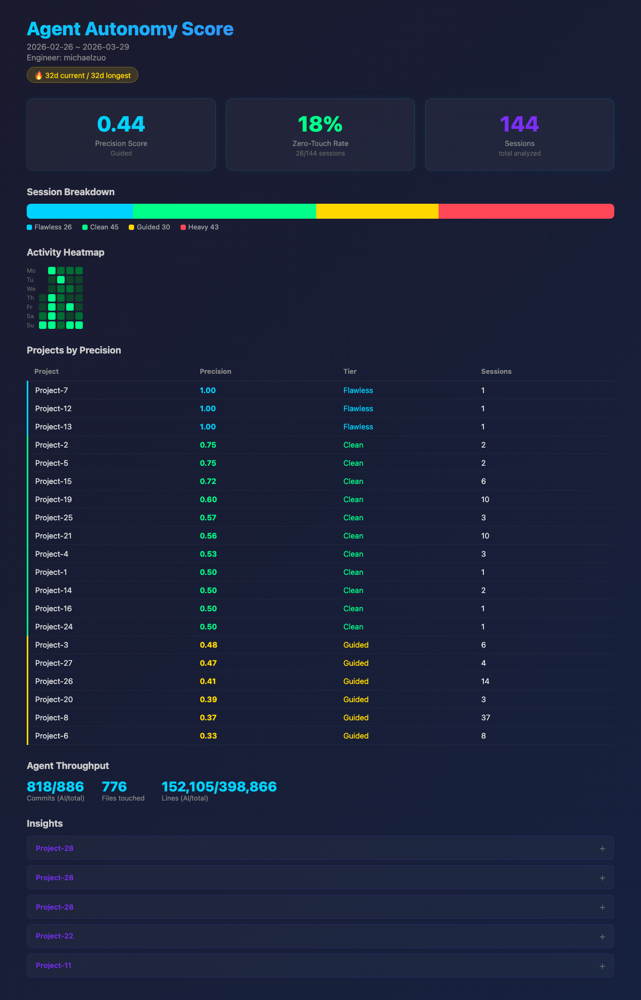

# Agent Autonomy Score

A local-first CLI tool that measures how effectively you orchestrate AI coding agents. Parses Claude Code session logs and scores each session by **orchestration precision** — how many corrections you needed after stating your initial intent.



## How It Works

1. **Parses** `~/.claude/projects/**/*.jsonl` session logs (read-only, never modified)
2. **Classifies** each user message as `intent`, `steering`, `clarification`, or `acknowledgment`
3. **Scores** each session: `precision = 1 / (1 + steering_count)` — fewer corrections = higher score
4. **Tiers** sessions: Flawless (1.0), Clean (0.50+), Guided (0.25+), Heavy (<0.25)
5. **Reports** per-project precision, activity heatmap, agent throughput, and actionable insights

## The Idea

If you direct AI agents rather than code yourself, the question isn't "how much did AI help me code" — it's **"how precisely did I translate intent into shipped code?"**

A session where you say "build X" and the AI delivers with zero corrections scores 1.0 (Flawless). A session where you correct the AI 4 times scores 0.2 (Heavy). Over time, your precision score tells you whether your prompts are getting better.

## Install

```bash
# One-liner with pipx (recommended)
pipx install "git+https://github.com/MichaelZuo-AI/AI-Coding-Observability.git"

# Or with pip
pip install "git+https://github.com/MichaelZuo-AI/AI-Coding-Observability.git"

# Or from source
git clone https://github.com/MichaelZuo-AI/AI-Coding-Observability.git
cd AI-Coding-Observability
python -m claude_analytics report
```

To upgrade: `pipx install --force "git+https://github.com/MichaelZuo-AI/AI-Coding-Observability.git"`

## Usage

```bash
# Full orchestration report
claude-analytics report

# Filter by date range
claude-analytics report --from 2026-02-01 --to 2026-02-28

# Filter by project
claude-analytics report --project MewtwoAI

# List recent sessions
claude-analytics sessions
claude-analytics sessions --limit 10
```

Each run saves an interactive HTML report to `reports/YYYY-MM-DD.html` — open it in any browser for a styled dashboard with animated metrics, hover tooltips, sortable tables, and collapsible insights.

## Message Classification

Each user message after the initial prompt is classified:

| Role | Detection | Examples |
|------|-----------|---------|
| **intent** | First message, or first after idle gap (>10 min) | "Build a login page with OAuth" |
| **steering** | Negation, correction, rejection patterns | "No, use Postgres not SQLite", "Revert that" |
| **clarification** | Response to AI's question | AI: "Which DB?" → User: "Postgres" |
| **acknowledgment** | Default — approval or continuation | "yes", "looks good", "go ahead" |

Only `steering` messages count against your precision score. Clarifications and acknowledgments are neutral.

## Privacy

- All processing is **100% local** — no data leaves your machine
- Session logs are read-only, never modified
- No API keys required — fully offline

## Testing

```bash
pip install -e ".[dev]"
pytest tests/ -v   # 247 tests
```
